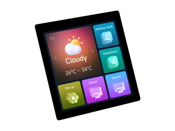

<div align="center">
  <h1>ESP32-S3-LCD-4 / ESP32-S3-Touch-LCD-4</h1>
  <p><strong>ESP32-S3 4 英寸 480 x 480 RGB LCD 开发板系列，提供带/不带 GT911 电容触摸版本</strong></p>
  <p>
    <a href="https://github.com/waveshareteam/ESP32-S3-Touch-LCD-4/actions/workflows/examples.yml"></a>
    <a href="LICENSE.txt"></a>
  </p>
  <p>
    <a href="README.md">English</a> ·
    <a href="https://www.waveshare.net/shop/ESP32-S3-Touch-LCD-4.htm">🌐 产品页面</a> ·
    <a href="https://www.waveshare.net/wiki/ESP32-S3-Touch-LCD-4">📚 产品文档</a> ·
    <a href="https://github.com/waveshareteam/ESP32-S3-Touch-LCD-4/actions/workflows/examples.yml">📦 CI 固件</a> ·
    <a href="examples/esp-idf/">🧩 ESP-IDF 示例</a> ·
    <a href="examples/arduino/">🔧 Arduino 示例</a>
  </p>
  
</div>

---

## ✨ 概述

本仓库为 Waveshare ESP32-S3-Touch-LCD-4 和 ESP32-S3-LCD-4 提供第一方
ESP-IDF 与 Arduino 示例、由源码构建且可直接烧录的 CI 固件、出厂恢复固件以及
V4.0 硬件参考资料。

两款板卡均集成 ESP32-S3、4 英寸圆形 RGB 显示屏、大容量 Flash 与 PSRAM、
RTC、microSD、RS485、TWAI/CAN、电池支持和 CH32V003 辅助控制器。
Touch 版本另外配备 GT911 电容触摸屏。

| 板卡 | 触摸 | 推荐用途 |
| --- | --- | --- |
| ESP32-S3-Touch-LCD-4 | GT911 电容触摸 | 全部显示、触摸、LVGL 和 ESP-Brookesia 示例 |
| ESP32-S3-LCD-4 | 未装配 | 显示与外设示例；依赖指针输入的流程需要适配 |

## 🖥️ 硬件概览

| 功能 | 器件 / 接口 |
| --- | --- |
| 主控 | ESP32-S3-WROOM-1-N16R8，双核 Xtensa LX7，最高 240 MHz |
| 存储 | 16 MB Flash 和 8 MB Octal PSRAM |
| 无线连接 | 2.4 GHz Wi-Fi 和 Bluetooth 5 LE |
| 显示屏 | 4 英寸 480 x 480 RGB LCD，带串行控制接口 |
| 触摸 | ESP32-S3-Touch-LCD-4 配备 GT911 I2C 电容触摸 |
| 辅助控制器 | CH32V003F4U6，通过 I2C 控制背光、复位、蜂鸣器、电源并读取电池 ADC |
| 实时时钟 | PCF85063ATL，地址 `0x51`；ESP-IDF 示例使用 [`waveshare/pcf85063a`](https://components.espressif.com/components/waveshare/pcf85063a) |
| 现场总线 | TJA1051 TWAI/CAN 收发器和 SP3485 RS485 收发器 |
| 存储接口 | microSD 卡槽，使用 1-bit SDMMC |
| 电源 | USB Type-C、外部直流与电池输入、充电和电池电压检测 |
| 板级支持 | 托管 BSP：[`waveshare/esp32_s3_touch_lcd_4`](https://components.espressif.com/components/waveshare/esp32_s3_touch_lcd_4) |
| 硬件文件 | [V4.0 硬件参考](hardware/HARDWARE_REFERENCE_CN.md)和[原理图](hardware/schematics/) |

> [!IMPORTANT]
> 仓库内原理图覆盖 ESP32-S3-Touch-LCD-4 V4.0。涉及电气连接时，请同时以原理图和
> 实际板卡版本为准。ESP32-S3-LCD-4 的特定硬件版本信息还应核对产品文档。部分在线
> 资料描述的是使用不同 IO 扩展器或引脚连接的早期硬件版本。

## 📦 固件产物

体验源码示例最快的方式是从
[Build Examples 工作流](https://github.com/waveshareteam/ESP32-S3-Touch-LCD-4/actions/workflows/examples.yml)
下载可直接烧录的 artifact。

1. 打开目标分支或标签对应的成功工作流。
2. 下载与开发框架、示例和框架版本匹配的 artifact。
3. 解压文件，并使用 `python -m pip install esptool` 安装 esptool。
4. 通过 USB 连接开发板，在 Windows 上运行 `flash.bat COMx`，或在 Linux 上运行
   `./flash.sh /dev/ttyACM0`。

每个压缩包都包含固件清单、烧录参数、辅助脚本和所需二进制文件。维护者也可以下载
当前分支最近一次成功构建的全部 artifact：

```bash
python3 releases/download_artifacts.py --clean
```

仓库内的 [V4.0 工厂/恢复镜像](firmware/ESP32-S3-Touch-LCD-4-V4.0-FactoryOnly-251122.bin)
是为带触摸板卡发布的二进制文件，不由 CI 重新构建。请将工厂/恢复固件与 CI 从源码
构建的固件分开使用。两者的区别和烧录说明见[固件产物](docs/firmware_CN.md)。

## 🛠️ 从源码构建

### ESP-IDF

每个 ESP-IDF 目录都是独立工程。可使用 CI 当前配置的 ESP-IDF 版本，从板级
IO 扩展示例开始：

```bash
cd examples/esp-idf/ioexpander
idf.py set-target esp32s3
idf.py build
idf.py -p <PORT> flash monitor
```

把 `<PORT>` 替换为开发板串口，例如 Windows 下的 `COMx`。Arduino 板卡选项、随附库和推荐学习顺序见
[示例指南](examples/README_CN.md)。

### Arduino

配置 Arduino CLI 和 Espressif 开发板包后，安装当前 CI 矩阵中的 core 版本，
并使用仓库随附库编译示例：

```bash
arduino-cli config init --overwrite
arduino-cli config add board_manager.additional_urls https://espressif.github.io/arduino-esp32/package_esp32_index.json
arduino-cli core update-index
arduino-cli core install esp32:esp32@3.3.11
arduino-cli compile \
  --fqbn "esp32:esp32:esp32s3:USBMode=hwcdc,CDCOnBoot=cdc,FlashSize=16M,PSRAM=opi,PartitionScheme=app3M_fat9M_16MB" \
  --libraries examples/arduino/libraries \
  examples/arduino/01_HelloWorld
```

## 🧪 示例

### ESP-IDF

| 示例 | 功能 | 适用板卡 |
| --- | --- | --- |
| [ioexpander](examples/esp-idf/ioexpander/README_CN.md) | CH32V003 初始化、I2C 恢复、复位、背光、蜂鸣器和电池 ADC | 两款 |
| [01_RS485_Test](examples/esp-idf/01_RS485_Test/README_CN.md) | RS485 接收和回传 | 两款 |
| [02_SD_Test](examples/esp-idf/02_SD_Test/README_CN.md) | microSD 挂载、读写、格式化和上电/复位流程 | 两款 |
| [03_RTC_Test](examples/esp-idf/03_RTC_Test/README_CN.md) | PCF85063A 时间/日期读写和闹钟中断 | 两款 |
| [04_TWAIreceive](examples/esp-idf/04_TWAIreceive/README_CN.md) | TWAI/CAN 接收和帧回传 | 两款 |
| [05_TWAItransmit](examples/esp-idf/05_TWAItransmit/README_CN.md) | TWAI/CAN 周期发送测试帧 | 两款 |
| [06_lvgl_demo_v8](examples/esp-idf/06_lvgl_demo_v8/README_CN.md) | BSP 显示初始化和 LVGL v8 widgets | Touch 版直接使用；LCD-only 需适配 BSP 启动 |
| [07_lvgl_demo_v9](examples/esp-idf/07_lvgl_demo_v9/README_CN.md) | BSP 显示初始化和 LVGL v9 benchmark | Touch 版直接使用；LCD-only 需适配 BSP 启动 |
| [08_ESP32-S3-Touch-LCD-4-esp-brookesia](examples/esp-idf/08_ESP32-S3-Touch-LCD-4-esp-brookesia/README_CN.md) | ESP-Brookesia Phone UI、计算器、画板和 CAN 任务 | 推荐触摸版 |
| [09_BatteryVoltage_LVGL](examples/esp-idf/09_BatteryVoltage_LVGL/README_CN.md) | 使用 LVGL 显示电池电压采样 | 两款 |

### Arduino

| 示例 | 功能 | 适用板卡 |
| --- | --- | --- |
| [01_HelloWorld](examples/arduino/01_HelloWorld/) | Arduino GFX 显示初始化 | 两款 |
| [02_AsciiTable](examples/arduino/02_AsciiTable/) | GFX 文本和 ASCII 字符渲染 | 两款 |
| [03_Drawing_points](examples/arduino/03_Drawing_points/) | GT911 触摸画板 | 交互需要触摸版 |
| [05_GFX_PCF85063_simpleTime](examples/arduino/05_GFX_PCF85063_simpleTime/) | PCF85063 RTC 与 GFX 显示 | 两款 |
| [06_GFX_ESPWiFiAnalyzer](examples/arduino/06_GFX_ESPWiFiAnalyzer/) | Wi-Fi 扫描和信道可视化 | 两款 |
| [07_GFX_Clock](examples/arduino/07_GFX_Clock/) | 图形时钟渲染 | 两款 |
| [08_LVGL_PCF85063_simpleTime](examples/arduino/08_LVGL_PCF85063_simpleTime/) | PCF85063 RTC 与 LVGL 界面 | 两款 |
| [09_LVGL_Widgets](examples/arduino/09_LVGL_Widgets/) | LVGL widgets 演示 | 两款；触摸可选 |
| [10_LVGL_SD](examples/arduino/10_LVGL_SD/) | microSD 访问和 LVGL 界面 | 两款 |
| [11_TWAItransmit](examples/arduino/11_TWAItransmit/) | TWAI/CAN 周期发送测试帧 | 两款 |
| [12_TWAIreceive](examples/arduino/12_TWAIreceive/) | TWAI/CAN 接收和帧回传 | 两款 |
| [13_RS485](examples/arduino/13_RS485/) | RS485 通信 | 两款 |
| [14_LVGL_BatteryVoltage](examples/arduino/14_LVGL_BatteryVoltage/) | 使用 LVGL 显示电池电压 | 两款 |

随附 Arduino 库位于
[`examples/arduino/libraries/`](examples/arduino/libraries/)。库自身的上游示例不会
进入产品 CI 矩阵。

## 🛠️ 支持的工具链

| 开发框架 | 版本 | 第一方固件构建数 |
| --- | --- | ---: |
| ESP-IDF | `v5.5.5` | 10 |
| ESP-IDF | `v6.0.2` | 10 |
| Arduino-ESP32 | `3.3.11` | 13 |

[Build Examples 工作流](https://github.com/waveshareteam/ESP32-S3-Touch-LCD-4/actions/workflows/examples.yml)
始终显示轻量 route 与 aggregate `ci-status` 状态，并按需运行最多 33 个固件构建任务。
每个成功构建都会打包为可直接烧录的 artifact。
[Test Repository Tools 工作流](https://github.com/waveshareteam/ESP32-S3-Touch-LCD-4/actions/workflows/repository-tools.yml)
负责验证示例发现、选择器和发布工具。

以上版本表示当前 CI 配置，不是永久兼容承诺；工作流与示例发现脚本共同是版本真值。

## 🔌 板卡调试提示

- CH32V003 的 I2C 地址为 `0x24`。屏幕不亮或背光无法调节时，请先确认 CH32
  初始化成功。背光通过 `custom_io_expander_set_pwm()` 使用 CH32 PWM 控制，
  范围为 0 到 255，不是普通 ESP32 LEDC 引脚。
- 快速复位后，应在初始化 CH32V003 前恢复共享 I2C 总线，并给 LCD/触摸复位线
  一个低脉冲。仓库内维护中的板级示例已经包含该流程。
- 电池示例按照 V4.0 原理图使用 `raw * 3.3 / 1023 * 3.0` 计算电压。
- 共享控制总线使用 SDA `GPIO15` 和 SCL `GPIO7`；RTC 闹钟信号连接到
  CH32V003 `EXIO7`。

## 🗂️ 仓库结构

| 路径 | 用途 |
| --- | --- |
| [`examples/esp-idf/`](examples/esp-idf/) | 第一方 ESP-IDF 工程 |
| [`examples/arduino/`](examples/arduino/) | 第一方 Arduino 示例和随附库 |
| [`firmware/`](firmware/) | 出厂烧录和恢复固件 |
| [`releases/`](releases/) | 固件打包和 artifact 下载工具 |
| [`hardware/`](hardware/) | V4.0 硬件参考和原理图 |
| [`config/`](config/) | 预留给可复用 ESP-IDF 共享 overlay；当前尚未启用 |
| [`docs/`](docs/) | 仓库、CI、组件、固件和兼容性说明 |

## 📚 文档

- [产品文档](https://www.waveshare.net/wiki/ESP32-S3-Touch-LCD-4)
- [硬件参考](hardware/HARDWARE_REFERENCE_CN.md)
- [示例指南](examples/README_CN.md)
- [仓库结构](docs/repository-structure_CN.md)
- [持续集成](docs/CI_CN.md)
- [托管组件](docs/components_CN.md)
- [固件与出厂恢复](docs/firmware_CN.md)
- [发布工具](releases/README_CN.md)
- [ESP-Brookesia 说明](docs/brookesia_CN.md)

## 🤝 支持与贡献

欢迎提交贡献和可复现的问题报告。请提供板卡型号和版本、示例路径、框架版本、
复现步骤、预期行为、实际行为以及相关串口日志。

- [贡献指南](CONTRIBUTING_CN.md)
- [技术支持](SUPPORT_CN.md)
- [安全策略](SECURITY_CN.md)
- [提交 Issue](https://github.com/waveshareteam/ESP32-S3-Touch-LCD-4/issues/new/choose)

## 📄 许可证

本仓库基于 Apache License 2.0 许可。详情见 [LICENSE.txt](LICENSE.txt)。
